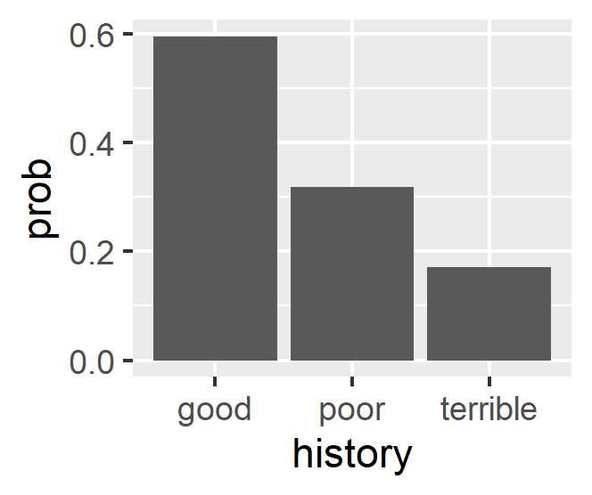
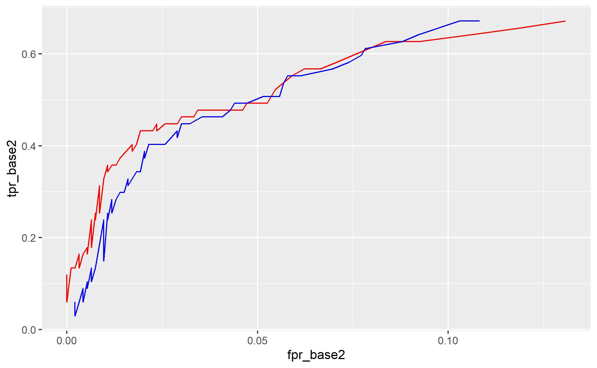

<!--   pdf_document: default
 md_document -->

```{r, include=FALSE}
options(tinytex.verbose = TRUE)
options(dplyr.summarise.inform = FALSE)
```

```{r setup, include=FALSE}
library(magrittr) # needs to be run every time you start R and want to use %>%
library(dplyr)    # alternatively, this also loads %>%
library(knitr)
library(tidyverse) 
library(sjmisc)
library(ggplot2)
library(reshape2)
library(gapminder)
library(mosaic)
library(extraDistr)
library(caret)
library(modelr)
library(parallel)
library(foreach)
library(rsample)
library(lubridate)
library(olsrr)
load("data.RData")
```

# 1) Saratoga house prices

## Pricing Strategy

### Main Focus: More preciously prediction for price
For the tax manager who want to know the precious prediction for price, we made more precious model from the data and suggested the points what elemets affect on how much price is. 

### Data
The description of the dataset in the salatago house;

<Independent variable>
- price: price (1000s of US dollars)

<Dependent variables(numerical)>
- lotSize: size of lot (square feet)
- Age: age of house (years)
- landValue: value of land (1000s of US dollars)
- livingArea: living are (square feet)
- pctCollege: percent of neighborhood that graduated college
- bedrooms: number of bedrooms
- fireplaces: number of fireplaces
- bathrooms: number of bathrooms (half bathrooms have no shower or tub)
- rooms: number of rooms

<Dependent variables(non-numerical)>
- heating: type of heating system
- fuel: fuel used for heating
- sewer: type of sewer system
- waterfront: whether property includes waterfront
- newConstruction: whether the property is a new construction
- centralAir: whether the house has central air

Documentation of the Saratago House dataset
https://r-data.pmagunia.com/dataset/r-dataset-package-mosaicdata-saratogahouses

### Model
We used the following steps to make the precious model.

- 1 Split data train/test dataset
- 2 Create squared variables and interaction variables of the numerical data in the SaratogaHouses

<Repeat start>
we repeated the followign procedures ten times and take an average of rmse

The estimation of the model is in the following


$$
\begin{aligned}
lm1:\quad Price &= \beta_0+\mathbb{\beta}^t(. -pctCollege -swer -waterfront -landValue\\
&\quad -newConstruction) \\
\\
lm2:\quad Price &= \beta_0+\mathbb{\beta}^t(lotSize^2 + age^2 + landValue^2 + livingArea^2 +\\ 
&\quad pctCollege^2 + bedrooms^2 + fireplaces^2 + bathrooms^2 + rooms^2 + \\
&\quad lotSize:age + landValue:age + livingArea:age + bedrooms:age) \\
\\
lm3:\quad Price &= \beta_0+\mathbb{\beta}^t(lotSize + age + landValue + \\
&\quad livingArea + pctCollege + bedrooms + fireplaces + bathrooms + rooms \\
&\quad + age:lotSize + landValue:lotSize + livingArea:lotSize + bedrooms:lotSize)\\
\\
lm4:\quad Price &= \beta_0+\mathbb{\beta}^t(lotSize + age + landValue + livingArea \\
&\quad + pctCollege + bedrooms + fireplaces + bathrooms + rooms \\
&\quad + age:bathrooms + landValue:bathrooms + livingArea:bathrooms + bedrooms:bathrooms) \\
\\
lm5 :\quad Price &= \beta_0+\mathbb{\beta}rt(. - heating - sewer - waterfront - newConstruction)^2 \\
\\
lm6: \quad Price &= \beta_0+\mathbb{\beta_1}()[numerical\ variables]^2+\mathbb{\beta_2}[interaction\ terms\ by\ each\ numerical\ variables]\\
&\quad +\mathbb{\beta_3}[non-numerical\ variables(dummy\ temrs)]
\end{aligned}
$$

- 3 Linear regression with some original setting(r1-r5) and  all variables(r6)
- 4 Knn regression with all variables
<up to this>

- 5 Compared the average of rmse in the linear model to find the best linear model, also compared it to Knn model to find better fit model
- 6 Summarized the better model and interpreted its meaning


### Results

```{r , eval=FALSE,echo=FALSE,fig.width =5.5, fig.height = 2,fig.align='center'}
# Setup
data(SaratogaHouses)

Lmrmse =NULL
Knnrmse =NULL
r1= NULL
r2=NULL
r3=NULL
r4 = NULL
r5=NULL
r6=NULL

# Function: Create polym2
## Input: Dataset
## Output: New Dataset
## Create polynominal term by each column
## Example: dataframe(column 1*column1, column 1*column 2, .... column i*column j,....)
  all_polym2 <- function (dataset){
      result <- dataset
        for (i in 1:ncol(dataset)){
          for (j in i:ncol(dataset)){
            if(j==i){
              tmp = as.data.frame(dataset[,j]^2)
              colnames(tmp) <- paste(colnames(dataset[j]),"sq")
            }else
            {
              tmp = as.data.frame(dataset[,i] * dataset[,j])
              colnames(tmp) <- paste(colnames(dataset[i]),"_",colnames(dataset[j]))
            }
            result <- as.data.frame(c(result,tmp))
          }
        }
      return(result)
    }

  
# Estimation
for (i in 1:10){
  ## Split into training and testing sets
  saratoga_split = initial_split(SaratogaHouses, prop = 0.8)
  saratoga_train = training(saratoga_split)
  saratoga_test = testing(saratoga_split)
  
  data_train <- as.data.frame(c(saratoga_train[1],all_polym2(saratoga_train[2:10]),saratoga_train[11:16]))
  data_test <- as.data.frame(c(saratoga_test[1],all_polym2(saratoga_test[2:10]),saratoga_test[11:16]))


  #Here lm1 is the medium model as per the lecture notes (taught in class).
  
  lm1 = lm(price ~. -pctCollege -sewer -waterfront -landValue-newConstruction, data=saratoga_train)
  
  lm2 = lm(price ~ lotSize^2 + age^2 + landValue^2 + livingArea^2 + pctCollege^2 + bedrooms^2 + fireplaces^2 + bathrooms^2 + rooms^2 + lotSize:age + landValue:age + livingArea:age + bedrooms:age, data=saratoga_train)
  
  lm3 = lm(price ~ lotSize + age + landValue + livingArea + pctCollege + bedrooms + fireplaces + bathrooms + rooms + age:lotSize + landValue:lotSize + livingArea:lotSize + bedrooms:lotSize, data=saratoga_train)
  
  lm4 = lm(price ~ lotSize + age + landValue + livingArea + pctCollege + bedrooms + fireplaces + bathrooms + rooms + age:bathrooms + landValue:bathrooms + livingArea:bathrooms + bedrooms:bathrooms, data=saratoga_train)
  
  lm5 = lm(price ~ (. - heating - sewer - waterfront - newConstruction)^2, data=saratoga_train)

  ## Regression the linear model with all variables
## (because the more variables you will add to the model, the lower rmse you can get) 
  
  lm6 = lm(price~ ., data=data_train)
  
  r1[i] = rmse(lm1, saratoga_test)
  r2[i] = rmse(lm2, saratoga_test)
  r3[i] = rmse(lm3, saratoga_test)
  r4[i] = rmse(lm4, saratoga_test)
  r5[i] = rmse(lm5, saratoga_test)
  r6[i] = rmse(lm6,data_test)


  ## Regression the Knn model with all variables
  ### now rescale for KNN with variables else dummies
  X_train <- saratoga_train[,2:10]
  X_test <- saratoga_test[,2:10]
  
  scale_train = apply(X_train, 2, sd) # calculate std dev for each column
  Xtilde_train = scale(X_train, scale = scale_train) %>% as.data.frame
  Xtilde_test = scale(X_test, scale = scale_train) %>% as.data.frame # use the training set scales!
  
  Xtilde_train = as.data.frame(cbind(Xtilde_train, saratoga_train['price'],saratoga_train[,11:16]))
  Xtilde_test = as.data.frame(cbind(Xtilde_test, saratoga_test['price'],saratoga_test[,11:16]))
    
  maxK=200
  ## KNN
    knnrmse = foreach(K = 2:maxK, .combine='rbind') %do% {
    knn = knnreg(price ~ ., data=Xtilde_train, k=K)
    c(k=K,rmse=modelr::rmse(knn,Xtilde_test))
    }%>% as.data.frame
    
    Knnrmse = as.data.frame(cbind(Knnrmse, knnrmse$rmse))
  }

## Compared the result of the linear and knn( knn' rmse selected by the minimum of rmse)


result_lm1 = mean(r1, 1, mean, na.rm=TRUE)
result_lm2 = mean(r2, 1, mean, na.rm=TRUE)
result_lm3 = mean(r3, 1, mean, na.rm=TRUE)
result_lm4 = mean(r4, 1, mean, na.rm=TRUE)
result_lm5 = mean(r5, 1, mean, na.rm=TRUE)
result_lm6 = mean(r6, 1, mean, na.rm=TRUE)

result_knn = as.data.frame(apply(Knnrmse[,1:10], 1, mean, na.rm=TRUE))
result_knn =result_knn[result_knn ==min(result_knn ),]
result = c(result_lm1,result_lm2,result_lm3,result_lm4,result_lm5,result_lm6,result_knn)
#summary(model1)
```

3 Linear regression with medium model,'lm1'(r1), some original setting(r2-r5) and all variables(r6)
5 Compared the average of rmse in the linear model to find the best linear model, also compared it to KNN model to find better fit model

Here linear model 1 (lm1) is the medium model as mentioned in the lecture slide, wherein professor has mentioned that the medium model is price versus all variables above (main effects only). Now using the combination of transformations and by adding the interactions, we have tried to handbuild a model for price that outperforms the medium model that has alreday been discussed in class. From the results obtained so far, we have found that the best model is the linear model 4 (lm4) as it has the lowest RMSE value of 54993.45. This lowest rmse value will vary for another train/ test split, on different run ("Horse Race", as mentioned in question). Here the lm4 model is obtained by interacting the 'bathrooms' variable with all other quantitative variables. The reason for interacting with 'bathrooms' is that bathroom coefficient is not only significant, but also it has the largest coefficient value as shown in the result below in almost all regressions. Here we may mention that in this run, we have found the rmse values of 65866.46, 58850.56, 56977.74, 54993.45, 59741.09, 59496.35, 77399.71 for linear models 1(r1), 2(r2), 3(r3), 4(r4), 5(r5), KNN model and K-CV model respectively. Thus clearly lm4 model is found to be the best model with lowest rmse value.


```{r , eval=FALSE,echo=FALSE,fig.width =5.5, fig.height = 2,fig.align='center'}
# K-CV
data <- SaratogaHouses[,2:10]
scale_train = apply(data, 2, sd) # calculate std dev for each column
data_tilde = scale(data , scale = scale_train) %>% as.data.frame

data_cv <- as.data.frame(c(SaratogaHouses[1],all_polym2(data_tilde),SaratogaHouses[11:16]))

K_folds = 5
saratoga_folds = crossv_kfold(data_cv, k=K_folds)

# Linear regression
model_lm1_cv = map(saratoga_folds$train, ~  lm(price ~. -pctCollege -sewer -waterfront -landValue-newConstruction, data=.))
model_lm4_cv = map(saratoga_folds$train, ~ lm(price ~ lotSize + age + landValue + livingArea + pctCollege + bedrooms + fireplaces + bathrooms + rooms + age:bathrooms + landValue:bathrooms + livingArea:bathrooms + bedrooms:bathrooms, data = .))

rmse_lm1_cv = mean(map2_dbl(model_lm1_cv, saratoga_folds$test, modelr::rmse))
rmse_lm4_cv = mean(map2_dbl(model_lm4_cv, saratoga_folds$test, modelr::rmse))

# Knn
model_knncv = foreach(k = 1:200, .combine='rbind') %do% {
  models1 = map(saratoga_folds$train, ~ knnreg(price~ ., k=k, data = ., use.all=FALSE))
  errs1 = map2_dbl(models1, saratoga_folds$test, modelr::rmse)
  c(k=k, err = mean(errs1), std_err = sd(errs1)/sqrt(K_folds))
} %>% as.data.frame


knn_min_rmse=model_knncv[model_knncv$err==min(model_knncv$err),]
result_cv =c(rmse_lm1_cv ,rmse_lm4_cv,knn_min_rmse[2])
```

Also, We tried to do the same regression on the way of K-CV, and then we got the rmse of the linear regression(basic model) is 65608.13, that of linear model 4 is 54993.45, and that of the KNN regression is 62411.67. For the K-CV KNN regression we found the optimal K to be 5. This result looks the same as the results derived from taking average of ten rmses.


### Discussion: Comparison between Linear and LNN model
In this estimation, from the result that rmse of the linear model is smaller than that of knn model. We can think this reason is what the liner model that is set up  close to the true model.

## Conclusion for Tax authority

From the result of the estimation of the linear models and Knn model, Tax authority should use the linear model 'lm4' as best linear model because this model has the lowest rmse (compared to both the "medeium" model & K-nearest neighbour regression model) & the highest accuracy for predicting the price.

## Appendix

### Summary of the lm4 model(average)
```
Call:
lm(formula = price ~ lotSize + age + landValue + livingArea + 
    pctCollege + bedrooms + fireplaces + bathrooms + rooms + 
    age:bathrooms + landValue:bathrooms + livingArea:bathrooms + 
    bedrooms:bathrooms, data = saratoga_train)

Residuals:
    Min      1Q  Median      3Q     Max 
-264955  -33343   -5024   26653  441867 

Coefficients:
                       Estimate Std. Error t value Pr(>|t|)    
(Intercept)          -1.936e+04  2.053e+04  -0.943 0.345742    
lotSize               8.736e+03  2.374e+03   3.680 0.000243 ***
age                  -1.334e+02  1.464e+02  -0.911 0.362408    
landValue             1.537e+00  1.691e-01   9.090  < 2e-16 ***
livingArea            2.916e+01  1.092e+01   2.671 0.007661 ** 
pctCollege            3.143e+01  1.630e+02   0.193 0.847118    
bedrooms              1.948e+04  7.994e+03   2.437 0.014926 *  
fireplaces            4.307e+03  3.246e+03   1.327 0.184763    
bathrooms             4.410e+04  1.013e+04   4.353 1.44e-05 ***
rooms                 2.501e+03  1.069e+03   2.339 0.019464 *  
age:bathrooms         1.290e+01  8.153e+01   0.158 0.874311    
landValue:bathrooms  -2.759e-01  7.283e-02  -3.789 0.000158 ***
livingArea:bathrooms  2.185e+01  4.584e+00   4.766 2.08e-06 ***
bedrooms:bathrooms   -1.631e+04  3.897e+03  -4.185 3.04e-05 ***
---
Signif. codes:  0 ‘***’ 0.001 ‘**’ 0.01 ‘*’ 0.05 ‘.’ 0.1 ‘ ’ 1

Residual standard error: 57650 on 1368 degrees of freedom
Multiple R-squared:  0.6565,	Adjusted R-squared:  0.6533 
F-statistic: 201.2 on 13 and 1368 DF,  p-value: < 2.2e-16
```


\newpage

# 2) Classification and retrospective sampling

## Results
```{r ,  eval=FALSE,include=FALSE}
german_credit <- read.csv('german_credit.csv')

# Plot Default hisory
data_credit <- german_credit %>% group_by(history) %>% summarize(sum = sum(Default), num=n(), prob = sum/num)
ggplot(data =data_credit)+ geom_col(aes(x=history, y=prob))
ggsave("./graph/default_history.png")

logit_gc <- glm(Default ~ duration + amount + installment + age + history + purpose + foreign, data = german_credit, family=binomial)
coef(logit_gc) %>% round(2)

phat_test_logit_gc = predict(logit_gc, german_credit, type='response')
yhat_test_logit_gc = ifelse(phat_test_logit_gc > 0.5, 1, 0)
confusion_out_logit = table(y = german_credit$Default, yhat = yhat_test_logit_gc)
#confusion_out_logit
#sum(diag(confusion_out_logit))/sum(confusion_out_logit) # out-of-sample accuracy
#table(gc_test$Default)
#700/1000
```

The graph of the default probability by credit history is
```{r, echo=FALSE,out.width ="50%", out.height = "50%",fig.align='center'}
# Show the above result as a table

```


The result of the logit model that we built is 
```
        (Intercept)            duration              amount         installment                 age         historypoor 
              -0.71                0.03                0.00                0.22               -0.02               -1.11 
    historyterrible          purposeedu purposegoods/repair       purposenewcar      purposeusedcar       foreigngerman 
              -1.88                0.72                0.10                0.85               -0.80               -1.26

   yhat
y     0   1
  0 645  55
  1 211  89

accuracy rate
0.734

the result of the null model
  0   1 
700 300 

the null model accuracy rate
0.70
```

## Disucussion 

### What do you notice about the history variable vis-a-vis predicting defaults?

From the coefficient of the logit model, the poor and terrible of the history made the probability of default decrease.

### What do you think is going on here?

Intuitively, the poor and terrible credit the history should increase the probability of default. We got completely reverse results. So there is something with the bad estimation. We  think that because the cases of  the default is rare, we cannot collect data randomly(the data is not collected through random sampling), making the case of biased sampling. 

As this evidence, the bar graph has shows that people of the good credit history has the higher default probability. However, this is different from the intuitive result and is not reality.

### Do you think this data set is appropriate for building a predictive model of defaults

We don't think so. Because the out-of-sample accuracy rate is 0.734 while the null model accuracy rate is 0.70. Therefore, the improvement of the estimation is so low(only 3.4 percentage point).

### Would you recommend any changes to the bank's sampling scheme?

As we said above, the data should be collected randomly that will make biased decrease.

\newpage

# 3) Children and hotel reservations

## Model Building
```{r , eval=FALSE,include=FALSE}
hotels_dev <- read.csv('hotels_dev.csv')

hotels_dev_split = initial_split(hotels_dev, prop = 0.8)
hotels_dev_train= training(hotels_dev_split)
hotels_dev_test = testing(hotels_dev_split)

# Models
baseline1 <- glm(children~market_segment+adults+customer_type+is_repeated_guest,data=hotels_dev_train, family=binomial)
baseline2 <- glm(children~.-arrival_date,data=hotels_dev_train, family=binomial)

model <- glm(children~.-arrival_date+year(arrival_date)+month(arrival_date)+average_daily_rate:adults+days_in_waiting_list:adults+ stays_in_weekend_nights :adults+total_of_special_requests:adults+booking_changes:average_daily_rate+booking_changes:days_in_waiting_list+lead_time:booking_changes+lead_time^2,data=hotels_dev_train)

## (*)Other glms
## if add arrival year/month/date to the base line 2, the correction of the prediction is larger than that of the baseline 2
## And, I add three polynominal parameters()
## Caluculation of the variation "apply(hotels_dev_train, 2, sd)"
     #                     hotel                      lead_time        stays_in_weekend_nights           stays_in_weekend_nights  
     #                        NA                     91.1969864                      0.9870792                      1.9086186 
     #                    adults                       children                           meal                 market_segment 
     #                 0.5086470                      0.2743685                             NA                             NA 
     #      distribution_channel              is_repeated_guest         previous_cancellations previous_bookings_not_canceled 
     #                        NA                      0.2036092                      0.2917516                      1.7965860 
     #        reserved_room_type             assigned_room_type                booking_changes                   deposit_type 
     #                        NA                             NA                      0.7316105                             NA 
     #      days_in_waiting_list                  customer_type             average_daily_rate    required_car_parking_spaces 
     #                14.7206015                             NA                     48.7072715                             NA 
     # total_of_special_requests                   arrival_date 
     #                 0.8352343                             NA 


## (**)Others attempts--- But the correction of the prediction is lower than that of the baseline 2
## glmstep_b1 <- step(baseline1, scope=~(.)^2)
## 
## glm0 = glm(children ~ 1, data=hotels_dev_train, family=binomial)
## glm_forward = step(glm0, direction='forward',
## scope=~(market_segment+adults+customer_type+is_repeated_guest)^2)
##
##lm0 = lm(children ~ 1, data=hotels_dev_train)
##lm_forward0 = step(lm0, direction='forward',
##scope=~(market_segment+adults+customer_type+is_repeated_guest)^2)


# predict and rmse
predict1 <- predict(baseline1, newdata=hotels_dev_test, type='response')
predict2 <- predict(baseline2, newdata=hotels_dev_test, type='response')
predict3 <- predict(model, newdata=hotels_dev_test, type='response')
##predict4 <- predict(glm_forward, newdata=hotels_dev_test, type='response')
##predict5 <- predict(lm_forward, newdata=hotels_dev_test, type='response')
##predict6 <- predict(glmstep_b1, newdata=hotels_dev_test, type='response')


# predict
yhat_test1 = ifelse(predict1 > 0.5, 1, 0)
yhat_test2 = ifelse(predict2 > 0.5, 1, 0)
yhat_test3 = ifelse(predict3 > 0.5, 1, 0)
##yhat_test4 = ifelse(predict4 > 0.5, 1, 0)
##yhat_test5 = ifelse(predict5 > 0.5, 1, 0)
##yhat_test6 = ifelse(predict6 > 0.5, 1, 0)

confusion_out1= table(y = hotels_dev_test$children, yhat = yhat_test1)
confusion_out2= table(y = hotels_dev_test$children, yhat = yhat_test2)
confusion_out3= table(y = hotels_dev_test$children, yhat = yhat_test3)
##confusion_out4= table(y = hotels_dev_test$children, yhat = yhat_test4)
##confusion_out5= table(y = hotels_dev_test$children, yhat = yhat_test5)
##confusion_out6= table(y = hotels_dev_test$children, yhat = yhat_test6)

result1 = sum(diag(confusion_out1))/sum(confusion_out1)
result2 = sum(diag(confusion_out2))/sum(confusion_out2)
result3 = sum(diag(confusion_out3))/sum(confusion_out3)
##result4 = sum(diag(confusion_out4))/sum(confusion_out4)
##result5 = sum(diag(confusion_out5))/sum(confusion_out5)
##result6 = sum(diag(confusion_out6))/sum(confusion_out6)

rmse1=rmse(baseline1,hotels_dev_test) 
rmse2=rmse(baseline2,hotels_dev_test) 
rmse3=rmse(model,hotels_dev_test) 

#save.image("data.RData")
```

### Models

We shows the models that we used in this problems. First, the baseline 1 is
$$
\begin{aligned}
children = \beta_0+\boldsymbol \beta \mathbf{X}_{market\ segment,  \ adults,\ customer_type,\ is\ repeated\ guest}
\end{aligned}
$$

The baseline 2 is
$$
\begin{aligned}
children = \beta_0+\boldsymbol \beta \mathbf{X}_{all\ variables\ excpet\ arriving\ date}
\end{aligned}
$$

The our model is
$$
\begin{aligned}
children &= \beta_0+\boldsymbol \beta \mathbf{X}_{all\ variables\ excpet\ arriving\ date}+arriving\ year+ arriving\ month \\
& \quad +average\ daily\ rate\times adults \\
& \quad +\ days\ in\ waiting_list\times adults\\
&\quad + stays\ in\ weekend_nights\times adults\\
&\quad +total\ of\ special\ requests\times adults \\
&\quad +booking\ changes\times average\ daily\ rate\\
&\quad +booking\ changes\times days\ in\ waiting_list \\
&\quad +lead\ time \times booking\ changes \\
&\quad +(lead\ time)^2
\end{aligned}
$$

### Check

Out-of-sample accuracy rate by each model is
```{r, echo=FALSE}
knitr::kable(cbind(baseline1=result1,baseline2= result2,mymodel=result3))
```

Therefore, the model accuracy of my model is higher than the baseline2 by 0.1% and thn the baseline 1 by 1.7%. 

## Model validation: step 1

```{r , eval=FALSE,include=FALSE}
# Model Valuation: Step1
hotels_val <- read.csv('hotels_val.csv')

hotels_val_split = initial_split(hotels_val, prop = 0.8)
hotels_val_train= training(hotels_val_split)
hotels_val_test = testing(hotels_val_split)

baseline1 <- glm(children~market_segment+adults+customer_type+is_repeated_guest,data=hotels_val_train, family=binomial)
baseline2 <- glm(children~.-arrival_date,data=hotels_dev_train, family=binomial)

## I COULD NOT UNDERSTAND: glm(children~.-arrival_date,data=hotels_dev_train, family=binomial)
## The simple and same regression does not work =glm(children~.-arrival_date,data=hotels_dev_train, family=binomial)

#model_val <- glm(children~hotel+lead_time+stays_in_weekend_nights+stays_in_week_nights+adults+children+meal+market_segment+distribution_channel+is_repeated_guest+previous_cancellations+previous_bookings_not_canceled+reserved_room_type+assigned_room_type+booking_changes+deposit_type+days_in_waiting_list+customer_type+average_daily_rate+required_car_parking_spaces+total_of_special_requests+year(arrival_date)+month(arrival_date)+average_daily_rate:adults+days_in_waiting_list:adults+ stays_in_weekend_nights :adults+total_of_special_requests:adults+booking_changes:average_daily_rate+booking_changes:days_in_waiting_list+lead_time:booking_changes+lead_time^2,data=hotels_val_train, family=binomial)

model <-glm(children~adults,data=hotels_val_train, family=binomial)

predict_baselin1_val <- predict(baseline1, newdata=hotels_val_test, type='response')
predict_baselin2_val <- predict(baseline2, newdata=hotels_val_test, type='response')
predict_model_val <- predict(model_val, newdata=hotels_val_test, type='response')


## IF t=0.5
## yhat_test_val = ifelse(predict_val > 0.5, 1, 0)
## confusion_out_val= table(y = hotels_val_test$children, yhat = yhat_test_val)
## tpr = confusion_out_val[2,2]/sum(confusion_out_val[2,])
## fpr = confusion_out_val[1,2]/sum(confusion_out_val[1,])

## IF t= 0.05-0.95
## Since I could get some errors if t= 0-1, I set up like above but it looks like that does not matter with the overall results.
result_step1 <- foreach(t= seq(0.1,0.9,0.01), .combine=rbind) %do%{
  #yhat_base1_val = ifelse(predict_baselin1_val > t, 1, 0)
  yhat_base2_val = ifelse(predict_baselin2_val > t, 1, 0)  
  yhat_model_val = ifelse(predict_model_val > t, 1, 0)
  
  #confusion_base1_val= table(y = hotels_val_test$children, yhat = yhat_base1_val)
  confusion_base2_val= table(y = hotels_val_test$children, yhat = yhat_base2_val)
  confusion_model_val= table(y = hotels_val_test$children, yhat = yhat_model_val)

  #tpr_base1 = confusion_base1_val[2,2]/sum(confusion_model_val[2,])
  #fpr_base1 = confusion_base1_val[1,2]/sum(confusion_base1_val[1,])
  tpr_base2 = confusion_base2_val[2,2]/sum(confusion_base2_val[2,])
  fpr_base2 = confusion_base2_val[1,2]/sum(confusion_base2_val[1,])
  tpr_model = confusion_model_val[2,2]/sum(confusion_model_val[2,])
  fpr_model = confusion_model_val[1,2]/sum(confusion_model_val[1,])
  c(t=t,tpr_base2=tpr_base2,fpr_base2=fpr_base2,tpr_model=tpr_model,fpr_model=fpr_model)
} %>% as.data.frame

## Plot ROC curve
ggplot(data =result_step1)+ geom_line(aes(x=fpr_base2, y=tpr_base2),colour="red")+ geom_line(aes(x=fpr_model, y=tpr_model),color="blue")
ggsave("./graph/result_step1.png")
```

The ROC curve of baseline 2 and my model is

```{r, echo=FALSE,out.width ="70%", out.height = "70%",fig.align='center'}
# Show the above result as a table

```

red line: baseline 2, blue line: my model

From the graph, if FPR=0.05 my model has higher tpr than baseline 2, and so my model is better than baseline 2 in this case. 

However, in the low FPR, the TPR of baseline 2 is higher than that of my model, and so my model is worse than baseline 2. Also, in the high FPR, the TPR of baseline 2 is lower than that of my model, and so my model is better than baseline 2.


### Model validation: step 2

```{r , eval=FALSE,include=FALSE}
# Create Folds
hotels_val2 = crossv_kfold(hotels_val, k=20)

result_step2 = foreach(i = 1:20, .combine='rbind') %do% {
  # Model
  base_val2 <- glm(children~hotel+lead_time+stays_in_weekend_nights+stays_in_week_nights+adults+children+meal+market_segment+distribution_channel+is_repeated_guest+previous_cancellations+previous_bookings_not_canceled+reserved_room_type+assigned_room_type+booking_changes+deposit_type+days_in_waiting_list+customer_type+average_daily_rate+required_car_parking_spaces+total_of_special_requests,data=hotels_val2$train[[i]], family=binomial)
  model_val2 <- glm(children~.-arrival_date+year(arrival_date)+month(arrival_date)+average_daily_rate:adults+days_in_waiting_list:adults+ stays_in_weekend_nights :adults+total_of_special_requests:adults+booking_changes:average_daily_rate+booking_changes:days_in_waiting_list+lead_time:booking_changes+lead_time^2,data=hotels_val2$train[[i]], family=binomial)
  #Predict
  predict_base2 <- predict(base_val2 , newdata=hotels_val2$test[[i]], type='response')
  predict_val <- predict(model_val, newdata=hotels_val2$test[[i]], type='response')
  
  yhat_base2_val = ifelse(predict_base2 > 0.5, 1, 0)
  yhat_model_val = ifelse(predict_val > 0.5, 1, 0)

  confusion_base2_val= table(y = as.data.frame(hotels_val2$test[[i]])$children, yhat = yhat_base2_val)
  confusion_model_val= table(y = as.data.frame(hotels_val2$test[[i]])$children, yhat = yhat_model_val)
  # Estimation and Actual
  c(predict_base2 =sum(confusion_base2_val[,2]) , predict_model =  sum(confusion_model_val[,2]),actual=sum(confusion_model_val[2,]))
 } %>% as.data.frame
rownames(result_step2) <- c(1:20)

# Show the result on the Console
sum(result_step2$predict_base2)
sum(result_step2$predict_model)
sum(result_step2$actual)
#save.image("data.RData")
```

In this case, we assumed a threshold is 50%, and our results is in the following. 
```{r, echo=FALSE,out.width ="70%", out.height = "70%",fig.align='center'}
# Show the above result as a table
knitr::kable(result_step2)
knitr::kable(cbind(sum_base2=sum(result_step2$predict_base2), sum_predict=sum(result_step2$predict_model), sum_actual=sum(result_step2$actual)))
```

From the result, the predicting the total number of bookings with children by baseline 2 is 207, that by my model is 221, and that by actual data is 402. The accurancy of the prediction of the our model is around 50%, which is so lower than we expected. However, our model's accurancy of the prediction is higher than the baseline 2's one.
