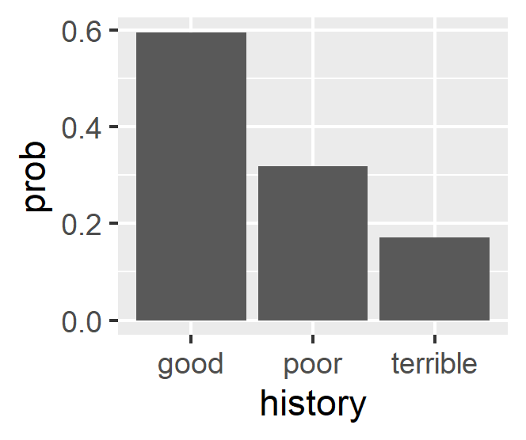

<!--   pdf_document: default
 md_document -->

# 1) Saratoga house prices

## Pricing Strategy

### Main Focus: More preciously prediction for price

For the tax manager who want to know the precious prediction for price,
we made more precious model from the data and suggested the points what
elemets affect on how much price is.

### Data

The description of the dataset in the salatago house;

<Independent variable> - price: price (1000s of US dollars)

&lt;Dependent variables(numerical)&gt; - lotSize: size of lot (square
feet) - Age: age of house (years) - landValue: value of land (1000s of
US dollars) - livingArea: living are (square feet) - pctCollege: percent
of neighborhood that graduated college - bedrooms: number of bedrooms -
fireplaces: number of fireplaces - bathrooms: number of bathrooms (half
bathrooms have no shower or tub) - rooms: number of rooms

&lt;Dependent variables(non-numerical)&gt; - heating: type of heating
system - fuel: fuel used for heating - sewer: type of sewer system -
waterfront: whether property includes waterfront - newConstruction:
whether the property is a new construction - centralAir: whether the
house has central air

Documentation of the Saratago House dataset
<https://r-data.pmagunia.com/dataset/r-dataset-package-mosaicdata-saratogahouses>

### Model

We used the following steps to make the precious model.

-   1 Split data train/test dataset
-   2 Create squared variables and interaction variables of the
    numerical data in the SaratogaHouses

<Repeat start> we repeated the followign procedures ten times and take
an average of rmse

The estimation of the model is in the following

$$
\begin{aligned}
lm1:\quad Price &= \beta\_0+\mathbb{\beta}^t(. -pctCollege -swer -waterfront -landValue\\\\
&\quad -newConstruction) \\\\
\\\\
lm2:\quad Price &= \beta\_0+\mathbb{\beta}^t(lotSize^2 + age^2 + landValue^2 + livingArea^2 +\\\\ 
&\quad pctCollege^2 + bedrooms^2 + fireplaces^2 + bathrooms^2 + rooms^2 + \\\\
&\quad lotSize:age + landValue:age + livingArea:age + bedrooms:age) \\\\
\\\\
lm3:\quad Price &= \beta\_0+\mathbb{\beta}^t(lotSize + age + landValue + \\\\
&\quad livingArea + pctCollege + bedrooms + fireplaces + bathrooms + rooms \\\\
&\quad + age:lotSize + landValue:lotSize + livingArea:lotSize + bedrooms:lotSize)\\\\
\\\\
lm4:\quad Price &= \beta\_0+\mathbb{\beta}^t(lotSize + age + landValue + livingArea \\\\
&\quad + pctCollege + bedrooms + fireplaces + bathrooms + rooms \\\\
&\quad + age:bathrooms + landValue:bathrooms + livingArea:bathrooms + bedrooms:bathrooms) \\\\
\\\\
lm5 :\quad Price &= \beta\_0+\mathbb{\beta}rt(. - heating - sewer - waterfront - newConstruction)^2 \\\\
\\\\
lm6: \quad Price &= \beta\_0+\mathbb{\beta\_1}()\[numerical\\ variables\]^2+\mathbb{\beta\_2}\[interaction\\ terms\\ by\\ each\\ numerical\\ variables\]\\\\
&\quad +\mathbb{\beta\_3}\[non-numerical\\ variables(dummy\\ temrs)\]
\end{aligned}
$$

-   3 Linear regression with some original setting(r1-r5) and all
    variables(r6)

-   4 Knn regression with all variables <up to this>

-   5 Compared the average of rmse in the linear model to find the best
    linear model, also compared it to Knn model to find better fit model

-   6 Summarized the better model and interpreted its meaning

### Results

3 Linear regression with medium model,‘lm1’(r1), some original
setting(r2-r5) and all variables(r6) 5 Compared the average of rmse in
the linear model to find the best linear model, also compared it to KNN
model to find better fit model

Here linear model 1 (lm1) is the medium model as mentioned in the
lecture slide, wherein professor has mentioned that the medium model is
price versus all variables above (main effects only). Now using the
combination of transformations and by adding the interactions, we have
tried to handbuild a model for price that outperforms the medium model
that has alreday been discussed in class. From the results obtained so
far, we have found that the best model is the linear model 4 (lm4) as it
has the lowest RMSE value of 54993.45. This lowest rmse value will vary
for another train/ test split, on different run (“Horse Race”, as
mentioned in question). Here the lm4 model is obtained by interacting
the ‘bathrooms’ variable with all other quantitative variables. The
reason for interacting with ‘bathrooms’ is that bathroom coefficient is
not only significant, but also it has the largest coefficient value as
shown in the result below in almost all regressions. Here we may mention
that in this run, we have found the rmse values of 65866.46, 58850.56,
56977.74, 54993.45, 59741.09, 59496.35, 77399.71 for linear models
1(r1), 2(r2), 3(r3), 4(r4), 5(r5), KNN model and K-CV model
respectively. Thus clearly lm4 model is found to be the best model with
lowest rmse value.

Also, We tried to do the same regression on the way of K-CV, and then we
got the rmse of the linear regression(basic model) is 65608.13, that of
linear model 4 is 54993.45, and that of the KNN regression is 62411.67.
For the K-CV KNN regression we found the optimal K to be 5. This result
looks the same as the results derived from taking average of ten rmses.

### Discussion: Comparison between Linear and LNN model

In this estimation, from the result that rmse of the linear model is
smaller than that of knn model. We can think this reason is what the
liner model that is set up close to the true model.

## Conclusion for Tax authority

From the result of the estimation of the linear models and Knn model,
Tax authority should use the linear model ‘lm4’ as best linear model
because this model has the lowest rmse (compared to both the “medeium”
model & K-nearest neighbour regression model) & the highest accuracy for
predicting the price.

## Appendix

### Summary of the lm4 model(average)

    Call:
    lm(formula = price ~ lotSize + age + landValue + livingArea + 
        pctCollege + bedrooms + fireplaces + bathrooms + rooms + 
        age:bathrooms + landValue:bathrooms + livingArea:bathrooms + 
        bedrooms:bathrooms, data = saratoga_train)

    Residuals:
        Min      1Q  Median      3Q     Max 
    -264955  -33343   -5024   26653  441867 

    Coefficients:
                           Estimate Std. Error t value Pr(>|t|)    
    (Intercept)          -1.936e+04  2.053e+04  -0.943 0.345742    
    lotSize               8.736e+03  2.374e+03   3.680 0.000243 ***
    age                  -1.334e+02  1.464e+02  -0.911 0.362408    
    landValue             1.537e+00  1.691e-01   9.090  < 2e-16 ***
    livingArea            2.916e+01  1.092e+01   2.671 0.007661 ** 
    pctCollege            3.143e+01  1.630e+02   0.193 0.847118    
    bedrooms              1.948e+04  7.994e+03   2.437 0.014926 *  
    fireplaces            4.307e+03  3.246e+03   1.327 0.184763    
    bathrooms             4.410e+04  1.013e+04   4.353 1.44e-05 ***
    rooms                 2.501e+03  1.069e+03   2.339 0.019464 *  
    age:bathrooms         1.290e+01  8.153e+01   0.158 0.874311    
    landValue:bathrooms  -2.759e-01  7.283e-02  -3.789 0.000158 ***
    livingArea:bathrooms  2.185e+01  4.584e+00   4.766 2.08e-06 ***
    bedrooms:bathrooms   -1.631e+04  3.897e+03  -4.185 3.04e-05 ***
    ---
    Signif. codes:  0 ‘***’ 0.001 ‘**’ 0.01 ‘*’ 0.05 ‘.’ 0.1 ‘ ’ 1

    Residual standard error: 57650 on 1368 degrees of freedom
    Multiple R-squared:  0.6565,    Adjusted R-squared:  0.6533 
    F-statistic: 201.2 on 13 and 1368 DF,  p-value: < 2.2e-16

# 2) Classification and retrospective sampling

## Results

The graph of the default probability by credit history is

The result of the logit model that we built is

            (Intercept)            duration              amount         installment                 age         historypoor 
                  -0.71                0.03                0.00                0.22               -0.02               -1.11 
        historyterrible          purposeedu purposegoods/repair       purposenewcar      purposeusedcar       foreigngerman 
                  -1.88                0.72                0.10                0.85               -0.80               -1.26

       yhat
    y     0   1
      0 645  55
      1 211  89

    accuracy rate
    0.734

    the result of the null model
      0   1 
    700 300 

    the null model accuracy rate
    0.70

## Disucussion

### What do you notice about the history variable vis-a-vis predicting defaults?

From the coefficient of the logit model, the poor and terrible of the
history made the probability of default decrease.

### What do you think is going on here?

Intuitively, the poor and terrible credit the history should increase
the probability of default. We got completely reverse results. So there
is something with the bad estimation. We think that because the cases of
the default is rare, we cannot collect data randomly(the data is not
collected through random sampling), making the case of biased sampling.

As this evidence, the bar graph has shows that people of the good credit
history has the higher default probability. However, this is different
from the intuitive result and is not reality.

### Do you think this data set is appropriate for building a predictive model of defaults

We don’t think so. Because the out-of-sample accuracy rate is 0.734
while the null model accuracy rate is 0.70. Therefore, the improvement
of the estimation is so low(only 3.4 percentage point).

### Would you recommend any changes to the bank’s sampling scheme?

As we said above, the data should be collected randomly that will make
biased decrease.

# 3) Children and hotel reservations

## Model Building

### Models

We shows the models that we used in this problems. First, the baseline 1
is
$$
\begin{aligned}
children = \beta\_0+\boldsymbol \beta \mathbf{X}\_{market\\ segment,  \\ adults,\\ customer\_type,\\ is\\ repeated\\ guest}
\end{aligned}
$$

The baseline 2 is
$$
\begin{aligned}
children = \beta\_0+\boldsymbol \beta \mathbf{X}\_{all\\ variables\\ excpet\\ arriving\\ date}
\end{aligned}
$$

The our model is
$$
\begin{aligned}
children &= \beta\_0+\boldsymbol \beta \mathbf{X}\_{all\\ variables\\ excpet\\ arriving\\ date}+arriving\\ year+ arriving\\ month \\\\
& \quad +average\\ daily\\ rate\times adults \\\\
& \quad +\\ days\\ in\\ waiting\_list\times adults\\\\
&\quad + stays\\ in\\ weekend\_nights\times adults\\\\
&\quad +total\\ of\\ special\\ requests\times adults \\\\
&\quad +booking\\ changes\times average\\ daily\\ rate\\\\
&\quad +booking\\ changes\times days\\ in\\ waiting\_list \\\\
&\quad +lead\\ time \times booking\\ changes \\\\
&\quad +(lead\\ time)^2
\end{aligned}
$$

### Check

Out-of-sample accuracy rate by each model is

<table>
<thead>
<tr class="header">
<th style="text-align: right;">baseline1</th>
<th style="text-align: right;">baseline2</th>
<th style="text-align: right;">mymodel</th>
</tr>
</thead>
<tbody>
<tr class="odd">
<td style="text-align: right;">0.9202222</td>
<td style="text-align: right;">0.9368889</td>
<td style="text-align: right;">0.9375556</td>
</tr>
</tbody>
</table>

Therefore, the model accuracy of my model is higher than the baseline2
by 0.1% and thn the baseline 1 by 1.7%.

## Model validation: step 1

The ROC curve of baseline 2 and my model is

red line: baseline 2, blue line: my model

From the graph, if FPR=0.05 my model has higher tpr than baseline 2, and
so my model is better than baseline 2 in this case.

However, in the low FPR, the TPR of baseline 2 is higher than that of my
model, and so my model is worse than baseline 2. Also, in the high FPR,
the TPR of baseline 2 is lower than that of my model, and so my model is
better than baseline 2.

### Model validation: step 2

In this case, we assumed a threshold is 50%, and our results is in the
following.

<table>
<thead>
<tr class="header">
<th style="text-align: right;">predict_base2</th>
<th style="text-align: right;">predict_model</th>
<th style="text-align: right;">actual</th>
</tr>
</thead>
<tbody>
<tr class="odd">
<td style="text-align: right;">8</td>
<td style="text-align: right;">7</td>
<td style="text-align: right;">14</td>
</tr>
<tr class="even">
<td style="text-align: right;">6</td>
<td style="text-align: right;">11</td>
<td style="text-align: right;">21</td>
</tr>
<tr class="odd">
<td style="text-align: right;">11</td>
<td style="text-align: right;">11</td>
<td style="text-align: right;">14</td>
</tr>
<tr class="even">
<td style="text-align: right;">10</td>
<td style="text-align: right;">10</td>
<td style="text-align: right;">19</td>
</tr>
<tr class="odd">
<td style="text-align: right;">10</td>
<td style="text-align: right;">9</td>
<td style="text-align: right;">19</td>
</tr>
<tr class="even">
<td style="text-align: right;">15</td>
<td style="text-align: right;">17</td>
<td style="text-align: right;">21</td>
</tr>
<tr class="odd">
<td style="text-align: right;">12</td>
<td style="text-align: right;">10</td>
<td style="text-align: right;">26</td>
</tr>
<tr class="even">
<td style="text-align: right;">8</td>
<td style="text-align: right;">7</td>
<td style="text-align: right;">26</td>
</tr>
<tr class="odd">
<td style="text-align: right;">5</td>
<td style="text-align: right;">6</td>
<td style="text-align: right;">19</td>
</tr>
<tr class="even">
<td style="text-align: right;">12</td>
<td style="text-align: right;">12</td>
<td style="text-align: right;">24</td>
</tr>
<tr class="odd">
<td style="text-align: right;">8</td>
<td style="text-align: right;">8</td>
<td style="text-align: right;">18</td>
</tr>
<tr class="even">
<td style="text-align: right;">8</td>
<td style="text-align: right;">8</td>
<td style="text-align: right;">17</td>
</tr>
<tr class="odd">
<td style="text-align: right;">7</td>
<td style="text-align: right;">8</td>
<td style="text-align: right;">17</td>
</tr>
<tr class="even">
<td style="text-align: right;">11</td>
<td style="text-align: right;">11</td>
<td style="text-align: right;">17</td>
</tr>
<tr class="odd">
<td style="text-align: right;">11</td>
<td style="text-align: right;">13</td>
<td style="text-align: right;">24</td>
</tr>
<tr class="even">
<td style="text-align: right;">13</td>
<td style="text-align: right;">15</td>
<td style="text-align: right;">21</td>
</tr>
<tr class="odd">
<td style="text-align: right;">12</td>
<td style="text-align: right;">11</td>
<td style="text-align: right;">20</td>
</tr>
<tr class="even">
<td style="text-align: right;">7</td>
<td style="text-align: right;">11</td>
<td style="text-align: right;">12</td>
</tr>
<tr class="odd">
<td style="text-align: right;">17</td>
<td style="text-align: right;">17</td>
<td style="text-align: right;">25</td>
</tr>
<tr class="even">
<td style="text-align: right;">16</td>
<td style="text-align: right;">19</td>
<td style="text-align: right;">28</td>
</tr>
</tbody>
</table>

<table>
<thead>
<tr class="header">
<th style="text-align: right;">sum_base2</th>
<th style="text-align: right;">sum_predict</th>
<th style="text-align: right;">sum_actual</th>
</tr>
</thead>
<tbody>
<tr class="odd">
<td style="text-align: right;">207</td>
<td style="text-align: right;">221</td>
<td style="text-align: right;">402</td>
</tr>
</tbody>
</table>

From the result, the predicting the total number of bookings with
children by baseline 2 is 207, that by my model is 221, and that by
actual data is 402. The accurancy of the prediction of the our model is
around 50%, which is so lower than we expected. However, our model’s
accurancy of the prediction is higher than the baseline 2’s one.
